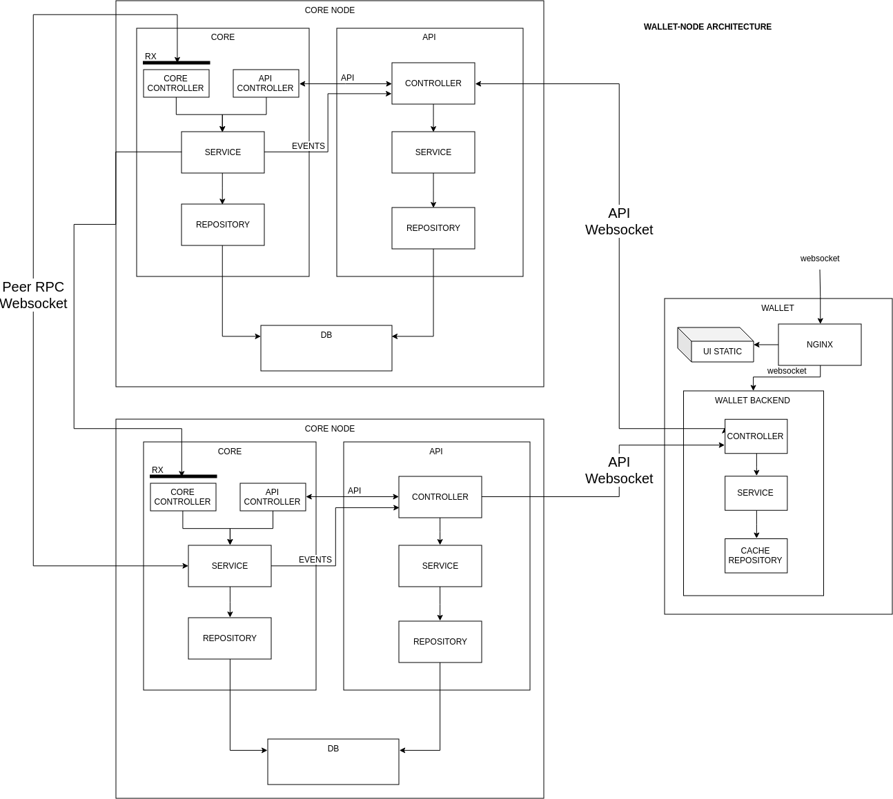

# Core-wallet interaction

DDK wallet is an application created to make interactions with DDK network comfortable for wide variety of users. DDK wallet is a centralized application interacting with DDK core through websocket API.

